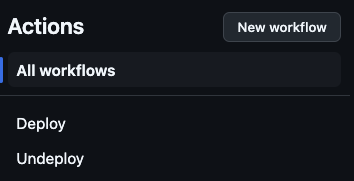
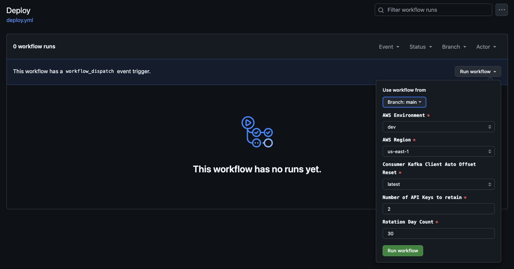

# IaC Confluent Resources Terraform Configuration
[Terraform](https://terraform.io), an open-source Infrastructure as Code (IaC) tool developed by HashiCorp, uses a **declarative** approach for managing infrastructure resources. Unlike **imperative** programming languages like Java, which require explicit, sequential commands to achieve a specific outcome, Terraform enables users to define their desired infrastructure state through configuration files using a YAML-like syntax. This approach abstracts the complexity of manual infrastructure management by allowing users to focus on "what" the final state should be rather than "how" to achieve it.

With Terraform, users can efficiently manage a wide range of [Confluent resources](https://registry.terraform.io/providers/confluentinc/confluent/latest/docs)—including Kafka Clusters, Environments, Schema Registry Clusters, Schemas, Topics, and Service Accounts—by defining their desired state in configuration files. Terraform maintains a detailed record of the current state of these resources and compares it against the desired state specified by the user. Based on this comparison, Terraform automatically generates a reconciliation plan to bring the existing infrastructure into alignment with the desired configuration. This process involves creating, updating, or deleting resources as needed, enabling consistent, repeatable, and predictable management of infrastructure components.

The configuration leverages the [**IaC Confluent API Key Rotation Terraform module**](https://github.com/j3-signalroom/iac-confluent-api_key_rotation-tf_module) to automate the creation and rotation of API Keys for both the [Kafka Cluster](https://registry.terraform.io/providers/confluentinc/confluent/latest/docs/resources/confluent_kafka_cluster) and the [Schema Registry Cluster](https://registry.terraform.io/providers/confluentinc/confluent/latest/docs/data-sources/confluent_schema_registry_clusters) in Confluent Cloud. This module ensures that each API Key is securely rotated based on a defined schedule, reducing the risk of credential compromise and improving the overall security of the data streaming environment.

To protect sensitive credentials, the configuration securely stores the generated API Key pairs for both resources in [**AWS Secrets Manager**](.blog/aws-secrets-manager-secrets.md), ensuring that only authorized users and services have access to these credentials. This secure storage method prevents unauthorized access and minimizes the risk of key exposure.

Additionally, the configuration manages **Kafka client configuration parameters**—such as consumer and producer settings—by storing them in the [**AWS Systems Manager Parameter Store**](.blog/aws-parameter-store-parameters.md). This approach centralizes the management of these parameters, provides secure access controls, and allows for easy versioning and auditing, simplifying the operational management of Kafka clients.

**Table of Contents**

<!-- toc -->
+ [1.0 Let's get started!](#10-lets-get-started)
+ [2.0 Resources](#20-resources)
<!-- tocstop -->

## 1.0 Let's get started!
**These are the steps**

1. Take care of the cloud and local environment prequisities listed below:
    > You need to have the following cloud accounts:
    > - [AWS Account](https://signin.aws.amazon.com/) *with SSO configured*
    > - [Confluent Cloud Account](https://confluent.cloud/)
    > - [GitHub Account](https://github.com) *with OIDC configured for AWS*
    > - [Terraform Cloud Account](https://app.terraform.io/)

    > You need to have the following installed on your local machine:
    > - [AWS CLI version 2](https://docs.aws.amazon.com/cli/latest/userguide/getting-started-install.html)
    > - [Confluent CLI version 3 or higher](https://docs.confluent.io/confluent-cli/4.0/overview.html)
    > - [Terraform CLI version 1.85 or higher](https://developer.hashicorp.com/terraform/install)

2. Get your Confluent Cloud API key pair, by execute the following Confluent CLI command to generate the Cloud API Key:

    > Click [here](.blog/why-do-you-need-the-confluent-cloud-api-key.md#2-integration-with-cicd-pipelines) to learn why you need it.

    ```shell
    confluent api-key create --resource "cloud" 
    ```

    Next, securely store the Confluent Cloud API Key and Secret in a reliable secret management solution, such as AWS Secrets Manager or GitHub Secrets. These platforms provide encrypted storage, access controls, and automated rotation capabilities, ensuring that sensitive credentials are protected against unauthorized access or leakage. Properly storing your API Key pair is critical because it is required to authenticate and authorize any interactions with the Confluent Cloud when executing your local scripts or running your Terraform configuration in environments like GitHub Actions. This API Key pair allows Terraform to provision, manage, and update Confluent Cloud resources as defined in your infrastructure code, maintaining a secure, automated deployment pipeline.

3. Clone the repo:
    ```shell
    git clone https://github.com/j3-signalroom/iac-confluent-resources-tf.git
    ```

4. Update the cloned Terraform module's [main.tf](main.tf) by following these steps:

    a. Locate the `terraform.cloud` block and replace **`signalroom`** with your [Terraform Cloud Organization Name](https://developer.hashicorp.com/terraform/cloud-docs/users-teams-organizations/organizations).

    b. In the `terraform.cloud.workspaces` block, replace **`iac-confluent-resources-workspace`** with your [Terraform Cloud Organization's Workspaces Name](https://developer.hashicorp.com/terraform/cloud-docs/workspaces).

5. To run repo's [Terraform configuration](main.tf) locally, follow these steps:

    a. Navigate to the root folder of the `iac-confluent-resources-tf/` repository that you cloned.

    b. Open a terminal in this directory.

    c. Execute the following [script](scripts/run-terraform-locally.sh):
    ```shell
    scripts/run-terraform-locally.sh <create | delete> --profile=<SSO_PROFILE_NAME> \
                                                       --environment_name=<ENVIRONMENT_NAME> \
                                                       --confluent_api_key=<CONFLUENT_API_KEY> \
                                                       --confluent_api_secret=<CONFLUENT_API_SECRET> \
                                                       --day_count=<DAY_COUNT> \
                                                       --auto_offset_reset=<earliest | latest>
    ```
    Argument placeholder|Replace with
    -|-
    `<SSO_PROFILE_NAME>`|your AWS SSO profile name for your AWS infrastructue that host your AWS Secrets Manager.
    `<ENVIRONMENT_NAME>`|your AWS environment name.
    `<CONFLUENT_API_KEY>`|your organization's Confluent Cloud API Key (also referred as Cloud API ID).
    `<CONFLUENT_API_SECRET>`|your organization's Confluent Cloud API Secret.
    `<DAY_COUNT>`|how many day(s) should the API Key be rotated for.
    `<AUTO_OFFSET_RESET>`|Specify where a Kafka Consumer should begin reading from in the Kafka Topic when it doesn't have any other valid offsets to start from.

6. Or, to run the repository's Terraform configuration from GitHub, follow these steps:

    a. **Deploy the Repository**: Ensure that you have cloned or forked the repository to your GitHub account.

    b. **Set Required Secrets and Variables**: Before running any of the GitHub workflows provided in the repository, you must define at least the `AWS_DEV_ACCOUNT_ID` variable (which should contain your AWS Account ID for your development environment). To do this:

    - Go to the **Settings** of your cloned or forked repository in GitHub.

    - Navigate to **Secrets and Variables** > **Actions**.

    - Add the `AWS_DEV_ACCOUNT_ID` and any other required variables or secrets.

    c. **Navigate to the Actions Page**:

    - From the cloned or forked repository on GitHub, click on the **Actions** tab.

    d. **Select and Run the Deploy Workflow**:

    - Find the **Deploy workflow** link on the left side of the Actions page and click on it.
    

    - On the **Deploy workflow** page, click the **Run workflow** button.

    - A workflow dialog box will appear. Fill in the necessary details and click **Run workflow** to initiate the Terraform deployment process.
    

    By following these steps, you will run the Terraform configuration directly from GitHub, leveraging GitHub Actions for automation and deployment.

## 2.0 Resources
[Terraform Confluent Provider GitHub Examples](https://github.com/confluentinc/terraform-provider-confluent/tree/master/examples/configurations)

[Create a Kafka Cluster on Confluent Cloud from a Template Using Terraform](https://docs.confluent.io/cloud/current/clusters/terraform-provider.html)

[YouTube video by Confluent on Getting started with the Confluent Terraform Provider](https://www.youtube.com/watch?v=ofSQ4j9u6W4)

[Automating Infrastructure as Code with Apache Kafka and Confluent ft. Rosemary Wang](https://developer.confluent.io/learn-more/podcasts/automating-infrastructure-as-code-with-apache-kafka-and-confluent-ft-rosemary-wang/?utm_medium=sem&utm_source=google&utm_campaign=ch.sem_br.nonbrand_tp.prs_tgt.dsa_mt.dsa_rgn.namer_lng.eng_dv.all_con.confluent-developer&utm_term=&creative=&device=c&placement=&gad_source=1&gclid=Cj0KCQjw28W2BhC7ARIsAPerrcISmtX3Y10dSCLzaSA8wLBdVfZLxh9QulaJQY55N-_oOoaLVjrggSoaAmRAEALw_wcB)

[Best Practices for Confluent Terraform Provider](https://www.confluent.io/blog/best-practices-confluent-terraform-provider/)